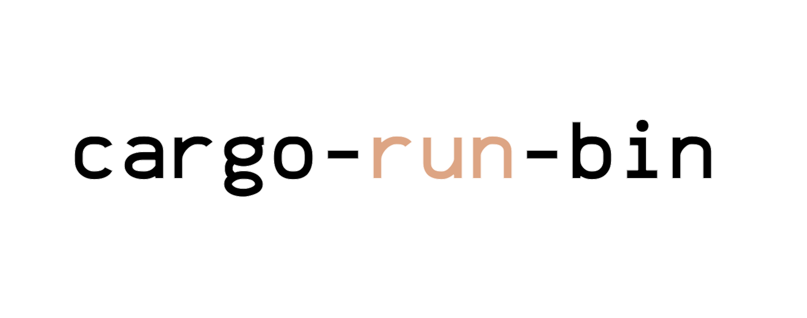

[](https://github.com/dustinblackman/cargo-run-bin/actions)
[](https://coveralls.io/github/dustinblackman/cargo-run-bin?branch=master)
[](https://crates.io/crates/cargo-run-bin)

> Build, cache, and run CLI tools scoped in `Cargo.toml` rather than installing globally. Stop the version drifts across your team, keep it all in sync within your project!

- [Overview](#overview)
- [Install](#install)
- [Usage](#usage)
  - [cargo bin CRATE](#cargo-bin-crate)
  - [cargo bin --sync-aliases](#cargo-bin---sync-aliases)
  - [cargo bin --install](#cargo-bin---install)
- [License](#license)

## Overview

Installing tooling globally when working in teams or on CI is a silly problem to manage. `cargo-run-bin` builds, caches, and executes binaries from their locked down versions in `Cargo.toml`. This acts similarly to [`npm run`](https://docs.npmjs.com/cli/v7/commands/npm-run-script) and [`gomodrun`](https://github.com/dustinblackman/gomodrun), and allows your teams to always be running the same tooling versions.

For command lines that extend cargo such as `cargo-nextest`, run-bin will create and manage cargo aliases to allow using cargo extensions without any changes to your command line scripts! `cargo-run-bin` gets out of your way, and you'll forget you're even using it!

## Install

Run the following to install `cargo-run-bin`, and ignore the cache directory in your project.

```sh
cargo install cargo-run-bin
cd my/rust/project
echo ".bin/" >> .gitignore
```

## Usage

`cargo-run-bin` keeps track of the binaries and their versions from within `Cargo.toml` under the `[package.metadata.bin]`.
table. A quick example taken from this repo:

```toml
[package.metadata.bin]
cargo-binstall = { version = "1.1.2" }
cargo-nextest = { version = "0.9.57", locked = true }
dprint = { version = "0.30.3" }
tauri-mobile = { version = "0.5.2", bins = ["cargo-android", "cargo-mobile"], locked = true }
```

Or if you're setting up in a workspace:

```toml
[workspace.metadata.bin]
cargo-binstall = { version = "1.1.2" }
cargo-nextest = { version = "0.9.57", locked = true }
```

| Parameter        | Type          | Required | Description                                                                                                                                                                                                                                                             |
| ---------------- | ------------- | -------- | ----------------------------------------------------------------------------------------------------------------------------------------------------------------------------------------------------------------------------------------------------------------------- |
| version          | `String`      | true     | Specifies the version of the crate.                                                                                                                                                                                                                                     |
| bins             | `Vec<String>` | false    | An array of binaries that the crate contains that you wish to build. These can be found in a crates `Cargo.toml` file. See [`tauri-mobile`](https://github.com/tauri-apps/tauri-mobile/blob/a5f3783870f48886e3266e43f92a6768fb1eb3d4/Cargo.toml#L18-L28) as an example. |
| locked           | `Boolean`     | false    | A parameter when set to `true` runs `cargo install` with the [`--locked`](https://doc.rust-lang.org/cargo/commands/cargo-install.html#dealing-with-the-lockfile) parameter.                                                                                             |
| features         | `Vec<String>` | false    | An array of crate features to enable.                                                                                                                                                                                                                                   |
| default-features | `Boolean`     | false    | When set to `false`, disables all default features.                                                                                                                                                                                                                     |
| git              | String        | false    | A git URL to install from rather than from crates.io. This will also be used by Binstall to look up Cargo manifist if Binstall is available.                                                                                                                            |
| branch           | String        | false    | A git branch to install from when `git` is set. This takes priority over `tag` and `rev`                                                                                                                                                                                |
| tag              | String        | false    | A git tag to install from when `git` is set. `branch` will take priority if set, and takes priority over `rev`.                                                                                                                                                         |
| rev              | String        | false    | A git revision to install from when `git` is set. `branch` and `tag` will take priority if set.                                                                                                                                                                         |

If you're a fan of prebuilt binaries and fast downloads, run-bin will use [`cargo-binstall`](https://github.com/cargo-bins/cargo-binstall) if it's installed globally, or configured within `[package.metadata.bin]`, rather than building tools from source.

### `cargo bin CRATE`

Taking an example of `dprint`, running `cargo bin dprint --help` with install/build and cache the dprint binary with the
specified version in `Cargo.toml`. All future executions will run instantly without an install step, and dprint can be used
as you wish!

### `cargo bin --sync-aliases`

With the power of [cargo aliases](https://doc.rust-lang.org/cargo/reference/config.html#alias), `cargo bin --sync-aliases`
will create aliases for any `cargo-*` crate, allowing you to execute commands such `cargo nextest run` that will use
`cargo bin` under the hood. Check out some of the example from [this repo](.cargo/config.toml).

### `cargo bin --install`

When pulling down a new repo, or adding a step to CI, `cargo bin --install` will install or build all binaries that have not been
cached which are configured in `Cargo.toml`.

## [License](./LICENSE)

MIT.
